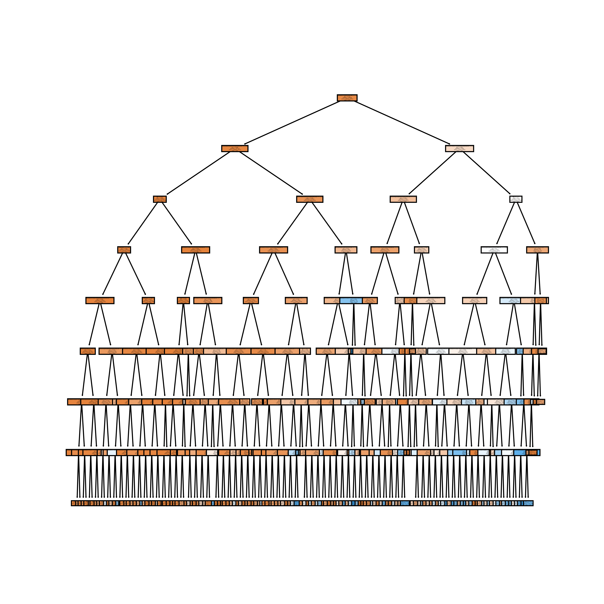

# Model Card

See the [example Google model cards](https://modelcards.withgoogle.com/model-reports) for inspiration. 

## Model Description

**Input:** Describe the inputs of your model 

The inputs of the model consists of the following features, associated with an individual's demographic and past borrowing behaviour:

 1. RevolvingUtilizationOfUnsecuredLines (FLOAT): Total balance on credit cards and personal lines of credit except real estate and no installment debt like car loans divided by the sum of credit limits
 2. Age (INT): Age of borrowers in years
 3. NumberOfTime30-59DaysPastDueNotWorse (INT): Number of times borrower has been 30-59 days past due but no worse in the last 2 years.
 4. DebtRatio (FLOAT): Monthly debt payments, alimony,living costs divided by monthy gross income
 5. MonthlyIncome (FLOAT): Individual's monthly income
 6. NumberOfOpenCreditLinesAndLoans (INT): Number of Open loans
 7. NumberOfTimes90DaysLate (INT): Number of times borrower has been 90 days or more past due.
 8. NumberRealEstateLoansOrLines (INT): Number of mortgage and real estate loans including home equity lines of credit
 9. NumberOfTime60-89DaysPastDueNotWorse (INT): Number of times borrower has been 60-89 days past due but no worse in the last 2 years.
 10. NumberOfDependents (INT): Number of dependents in family excluding themselves (spouse, children etc.)

**Output:** Describe the output(s) of your model

The output of the model consists of a binary classification of either 1 or 0, where "1" represents the fact the individual a person experienced 90 days past due delinquency or worse. This classification is based on the predicted probabilities that each class belongs to. 

**Model Architecture:** Describe the model architecture you’ve used]

The model uses a Random Forest Classifier. Random forest (RF) models make output predictions by combining outcomes from a sequence of regression decision trees. Below shows a sample architecture of how one of the estimator tree in a random forest looks like. This is merely for illustration purposes.

## Performance

The performance of the model was analyzed based on the classification of whether an individual was deemed to be delinquent with days past due 90 days. As a reacap, we are using the dataset containing an individual's credit history and we are using it to predict the fact the individual is a person who experienced 90 days past due delinquency or worse.

In order to assess the model's performance, a few metrics was used. We used a general accuracy score and AUC ROC score to see how the model performs. As we are using the underlying predicted probabilities of each class, we set the threshold for defining the positive class. Here, we set the threshold to any probability greater than 0.6 as the delinquent class (class 1). The reason for this is because we want to minimize the number of false positives, to truly identify bad actors. That said this threshold is flexible and can be defined based on requirements in the code.

**EVALUATION ON TRAINING DATASET: (131143, 11)**

- Accuracy Score: 0.9361468142140353
- AUC ROC Score: 0.8607028277797334

CLASSIFICATION REPORT OF TRAINING SET:

               precision    recall  f1-score   support

     class 0       0.93      1.00      0.97     24420
     class 1       0.72      0.05      0.09      1809

    accuracy                           0.93     26229

**EVALUATION ON HOLDOUT (UNSEEN) DATASET: (29169, 11)**

- Accuracy Score: 0.9378651453708159
- AUC ROC Score: 0.860959832140296

CLASSIFICATION REPORT OF HOLDOUT SET:

              precision    recall  f1-score   support

     class 0       0.94      1.00      0.97     13594
     class 1       0.67      0.05      0.10       955

    accuracy                           0.94     14549

We also used a classification report to examine the precision and recall. As we can see in both the training and holdout set, the model has a higher precision but a lower recall for predicting delinquent individuals. This means that while the model does not effectively predict all delinquents, most of those it predicted as delinquent are correct. The metrics summary report is shown above.

## Limitations

Outline the limitations of your model.

The limitations of the model is that it can only predict that the person experiences a 90 days past due delinquency or worse. As this is a classification model, it only gives a binary output and we cannot predict the actual number of days past due. Also, random forest models are prone to overfitting and while it will perform well on this dataset, one should be cautious about its accuracy.

## Trade-offs

Outline any trade-offs of your model, such as any circumstances where the model exhibits performance issues. 

The above limitation of overfitting in random forest models can lead to performance issues, as the model may suffer in terms of classification accuracy when predicting on newer and more updated data. There is need to retrain the model should we wish to introduce more updated data for prediction.

